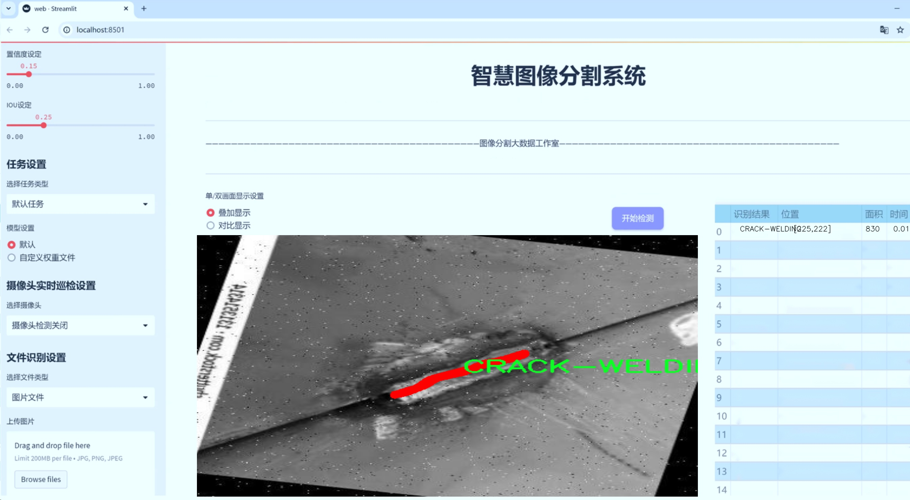
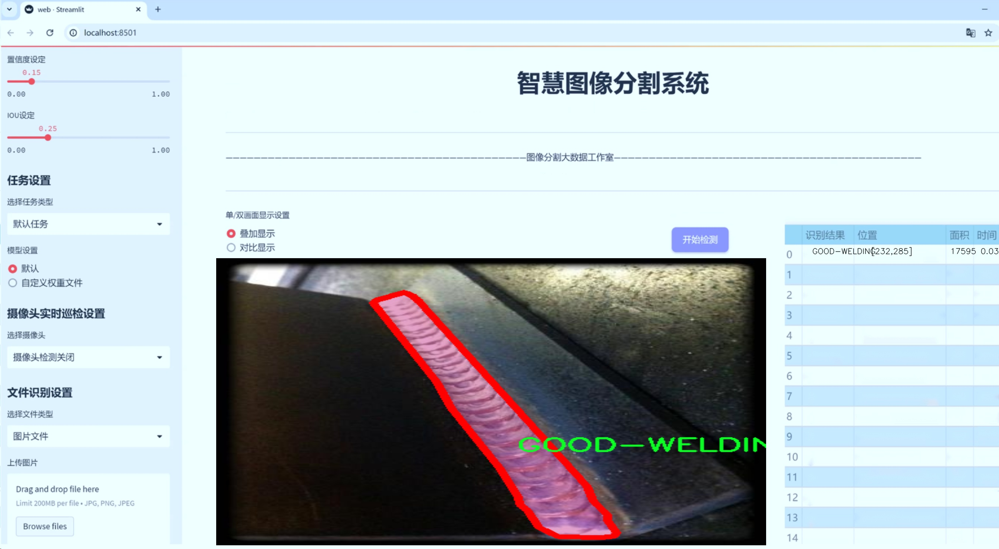
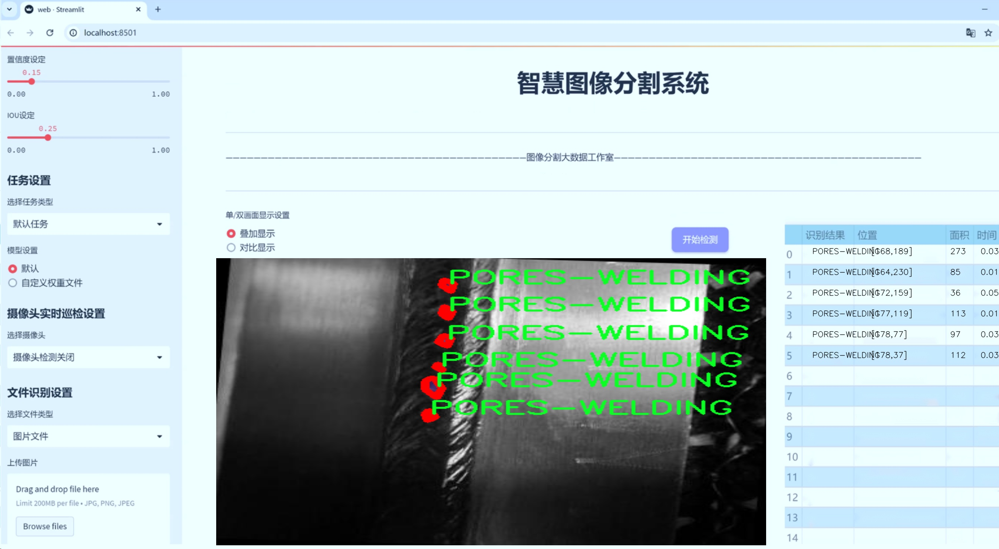
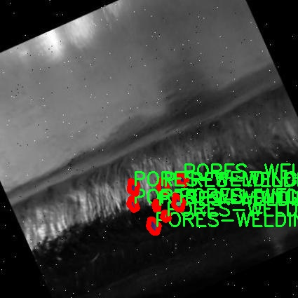
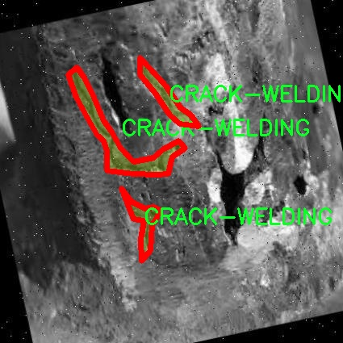
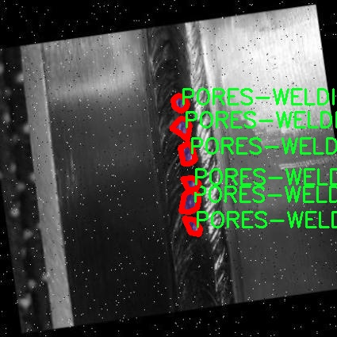
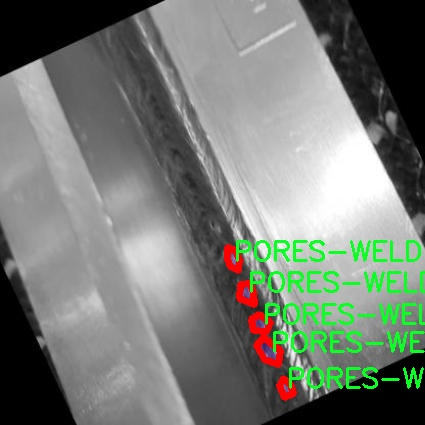
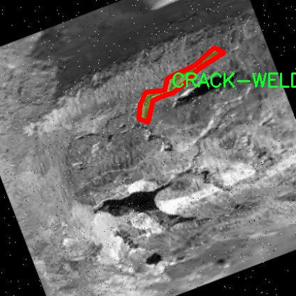
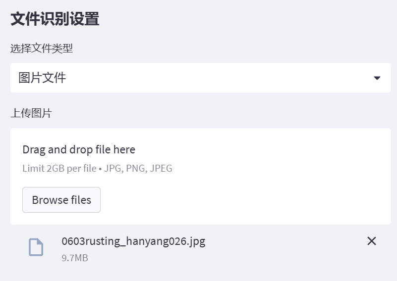

# 焊接缺陷分割系统： yolov8-seg-dyhead

### 1.研究背景与意义

[参考博客](https://gitee.com/YOLOv8_YOLOv11_Segmentation_Studio/projects)

[博客来源](https://kdocs.cn/l/cszuIiCKVNis)

研究背景与意义

焊接作为一种广泛应用于制造业和建筑行业的连接技术，其质量直接影响到结构的安全性和耐用性。随着工业自动化和智能制造的不断发展，焊接过程中的缺陷检测和质量控制变得愈发重要。传统的焊接缺陷检测方法主要依赖人工检查和经验判断，这不仅耗时耗力，而且容易受到人为因素的影响，导致检测结果的不准确性。因此，开发一种高效、准确的焊接缺陷检测系统，成为了行业内亟待解决的问题。

近年来，深度学习技术的迅猛发展为图像处理和缺陷检测提供了新的解决方案。尤其是基于卷积神经网络（CNN）的目标检测和分割模型，如YOLO（You Only Look Once）系列，因其在实时性和准确性方面的优势，逐渐成为焊接缺陷检测领域的研究热点。YOLOv8作为YOLO系列的最新版本，结合了多种先进的深度学习技术，具备更强的特征提取能力和更快的推理速度，为焊接缺陷的自动化检测提供了新的可能性。

本研究旨在基于改进的YOLOv8模型，构建一个高效的焊接缺陷分割系统。该系统将利用一个包含1100幅图像的焊接缺陷数据集，数据集中涵盖了三类焊接缺陷：焊接裂纹（CRACK-WELDING）、良好焊接（GOOD-WELDING）和焊接孔洞（PORES-WELDING）。通过对这些数据的深入分析和处理，研究将重点探讨如何利用YOLOv8模型进行实例分割，以实现对不同类型焊接缺陷的精准识别和定位。

在此背景下，研究的意义主要体现在以下几个方面：首先，基于YOLOv8的焊接缺陷分割系统能够大幅提高焊接质量检测的效率和准确性，减少人工检测的工作量和误差，进而提升焊接产品的整体质量。其次，该系统的开发将为焊接行业提供一种新的智能化解决方案，推动焊接技术的现代化和自动化进程，符合当前工业4.0的趋势。此外，通过对焊接缺陷的深入研究和数据集的构建，能够为后续相关领域的研究提供宝贵的数据支持和理论基础，促进焊接缺陷检测技术的进一步发展。

综上所述，基于改进YOLOv8的焊接缺陷分割系统的研究，不仅具有重要的理论价值，还有着广泛的应用前景。通过将深度学习技术与焊接缺陷检测相结合，能够有效提升焊接质量控制的智能化水平，为行业的可持续发展提供有力支持。随着研究的深入，期待该系统能够在实际应用中发挥重要作用，为焊接行业的安全与质量保障贡献力量。

### 2.图片演示







注意：本项目提供完整的训练源码数据集和训练教程,由于此博客编辑较早,暂不提供权重文件（best.pt）,需要按照6.训练教程进行训练后实现上图效果。

### 3.视频演示

[3.1 视频演示](https://www.bilibili.com/video/BV1sMzRYeE1V/)

### 4.数据集信息

##### 4.1 数据集类别数＆类别名

nc: 3
names: ['CRACK-WELDING', 'GOOD-WELDING', 'PORES-WELDING']


##### 4.2 数据集信息简介

数据集信息展示

在焊接工艺中，焊接缺陷的检测与分割是确保结构完整性和安全性的重要环节。为此，我们构建了一个名为“SOLDADURA”的数据集，旨在为改进YOLOv8-seg模型提供高质量的训练数据，以实现焊接缺陷的精确分割。该数据集包含了多种焊接缺陷的图像，涵盖了焊接过程中可能出现的主要问题，具体包括三类焊接缺陷：裂纹焊接（CRACK-WELDING）、良好焊接（GOOD-WELDING）和气孔焊接（PORES-WELDING）。这些类别的选择基于焊接行业的实际需求，旨在为焊接质量的评估提供全面的支持。

数据集中的每一类焊接缺陷都经过精心标注，确保了图像的准确性和一致性。裂纹焊接类包含了多种不同类型的裂纹，涵盖了从微小裂纹到较大裂纹的多种情况，这些裂纹可能会影响焊接接头的强度和耐久性。良好焊接类则代表了理想的焊接状态，作为对比样本，帮助模型学习到何为正常的焊接质量。气孔焊接类则主要集中在焊接过程中由于气体释放而形成的小孔，这些气孔可能会导致焊接接头的强度下降，进而影响整体结构的安全性。

数据集的构建过程包括了多种焊接工艺的图像采集，确保了数据的多样性和代表性。图像来源于不同的焊接场景，包括工厂生产线、实验室测试以及现场施工等，涵盖了不同的焊接材料和技术。这种多样性使得“SOLDADURA”数据集不仅能够有效反映焊接缺陷的实际情况，还能提高模型在不同环境下的泛化能力。

在数据预处理阶段，我们对图像进行了标准化处理，以确保输入到YOLOv8-seg模型中的数据具有一致的尺寸和格式。此外，为了增强模型的鲁棒性，我们还应用了数据增强技术，包括随机裁剪、旋转、翻转等操作，从而生成更多的训练样本。这些增强样本不仅丰富了数据集的内容，还提高了模型对不同焊接缺陷的识别能力。

通过使用“SOLDADURA”数据集，我们期望能够训练出一个高效的焊接缺陷分割系统，该系统能够准确识别和分割出焊接缺陷区域，从而为焊接质量的自动检测提供支持。最终，我们希望该系统能够在实际应用中帮助焊接工程师快速识别焊接缺陷，提高焊接质量，降低安全隐患。数据集的设计与构建不仅为YOLOv8-seg模型的训练提供了坚实的基础，也为焊接行业的智能化发展贡献了一份力量。











### 5.项目依赖环境部署教程（零基础手把手教学）

[5.1 环境部署教程链接（零基础手把手教学）](https://www.bilibili.com/video/BV1jG4Ve4E9t/?vd_source=bc9aec86d164b67a7004b996143742dc)


[5.2 安装Python虚拟环境创建和依赖库安装视频教程链接（零基础手把手教学）](https://www.bilibili.com/video/BV1nA4VeYEze/?vd_source=bc9aec86d164b67a7004b996143742dc)

### 6.手把手YOLOV8-seg训练视频教程（零基础手把手教学）

[6.1 手把手YOLOV8-seg训练视频教程（零基础小白有手就能学会）](https://www.bilibili.com/video/BV1cA4VeYETe/?vd_source=bc9aec86d164b67a7004b996143742dc)


按照上面的训练视频教程链接加载项目提供的数据集，运行train.py即可开始训练



     Epoch   gpu_mem       box       obj       cls    labels  img_size
     1/200     0G   0.01576   0.01955  0.007536        22      1280: 100%|██████████| 849/849 [14:42<00:00,  1.04s/it]
               Class     Images     Labels          P          R     mAP@.5 mAP@.5:.95: 100%|██████████| 213/213 [01:14<00:00,  2.87it/s]
                 all       3395      17314      0.994      0.957      0.0957      0.0843

     Epoch   gpu_mem       box       obj       cls    labels  img_size
     2/200     0G   0.01578   0.01923  0.007006        22      1280: 100%|██████████| 849/849 [14:44<00:00,  1.04s/it]
               Class     Images     Labels          P          R     mAP@.5 mAP@.5:.95: 100%|██████████| 213/213 [01:12<00:00,  2.95it/s]
                 all       3395      17314      0.996      0.956      0.0957      0.0845

     Epoch   gpu_mem       box       obj       cls    labels  img_size
     3/200     0G   0.01561    0.0191  0.006895        27      1280: 100%|██████████| 849/849 [10:56<00:00,  1.29it/s]
               Class     Images     Labels          P          R     mAP@.5 mAP@.5:.95: 100%|███████   | 187/213 [00:52<00:00,  4.04it/s]
                 all       3395      17314      0.996      0.957      0.0957      0.0845


### 7.50+种全套YOLOV8-seg创新点加载调参实验视频教程（一键加载写好的改进模型的配置文件）

[7.1 50+种全套YOLOV8-seg创新点加载调参实验视频教程（一键加载写好的改进模型的配置文件）](https://www.bilibili.com/video/BV1Hw4VePEXv/?vd_source=bc9aec86d164b67a7004b996143742dc)

### YOLOV8-seg算法简介

原始YOLOv8-seg算法原理

YOLOv8-seg算法是YOLO系列中的最新进展，旨在将目标检测与图像分割相结合，以实现更高效的视觉理解。作为YOLOv8的扩展版本，YOLOv8-seg不仅继承了YOLOv8在目标检测方面的优越性能，还引入了图像分割的能力，使得算法能够在处理复杂场景时提供更为精细的目标边界信息。该算法的设计理念是将目标检测和分割任务视为一个统一的回归问题，从而通过单一的神经网络架构同时完成这两项任务。

YOLOv8-seg的网络结构依然遵循YOLOv8的基本框架，分为输入端、骨干网络、颈部网络和头部网络四个主要部分。输入端通过马赛克数据增强、自适应锚框计算和自适应灰度填充等技术，确保了输入数据的多样性和丰富性。这些预处理步骤不仅提升了模型的鲁棒性，还为后续的特征提取打下了坚实的基础。

在骨干网络部分，YOLOv8-seg采用了改进的C2f结构，结合了空间金字塔池化（SPPF）模块，以增强特征提取的能力。C2f模块通过跨层连接和多分支结构，能够有效地捕捉到图像中的多尺度特征。这种设计使得网络在处理不同大小和形状的目标时，能够保持较高的特征表示能力。此外，SPPF模块的引入则进一步增强了模型对上下文信息的理解，使得分割结果更加准确。

颈部网络采用了路径聚合网络（PAN）结构，旨在加强不同尺度特征的融合能力。PAN通过自底向上的特征融合方式，能够有效地整合来自不同层次的特征信息，从而提高了模型对复杂场景的适应能力。在YOLOv8-seg中，颈部网络不仅为目标检测提供了丰富的特征信息，同时也为图像分割任务提供了必要的上下文信息，使得分割边界更加精确。

头部网络是YOLOv8-seg的核心部分，它将分类、检测和分割任务进行解耦处理。与传统的耦合头结构不同，YOLOv8-seg采用了解耦头设计，将分类和回归分为两个独立的分支。这样的设计使得每个任务能够更加专注于自身的目标，进而提升了模型在复杂场景下的定位精度和分类准确性。在分割任务中，YOLOv8-seg通过引入分割损失函数，结合像素级的标签信息，进一步优化了分割结果。

YOLOv8-seg的创新之处还在于其采用了无锚框（Anchor-Free）检测方法。这一方法摒弃了传统目标检测中对锚框的依赖，直接通过回归方式预测目标的位置和大小。这种设计不仅简化了模型的训练过程，还提高了模型在不同尺度和形状目标上的适应能力。通过这种方式，YOLOv8-seg能够更快地聚焦于目标位置的邻近点，从而使得预测框更接近于实际的边界框区域。

在损失计算方面，YOLOv8-seg综合了多种损失函数，以提升模型的整体性能。分类分支采用了二元交叉熵损失（BCELoss），而回归分支则结合了分布焦点损失（DFLoss）和完全交并比损失函数（CIOULoss）。这种多样化的损失计算策略使得模型在训练过程中能够更好地平衡分类和回归任务，从而提升了整体的检测和分割精度。

YOLOv8-seg的优势不仅体现在其高效的性能上，还在于其灵活的模型设置。通过调整深度因子、宽度因子和通道数等参数，用户可以根据具体应用场景的需求，灵活配置模型的复杂度。这种灵活性使得YOLOv8-seg能够在各种硬件平台上高效运行，满足实时检测和分割的需求。

综上所述，YOLOv8-seg算法通过将目标检测与图像分割相结合，利用改进的网络结构和创新的损失计算策略，实现了在复杂场景下的高效视觉理解。其无锚框检测方法和解耦头设计使得模型在处理多样化目标时，能够保持较高的精度和速度。这些特性使得YOLOv8-seg成为了当前视觉任务中的一种强大工具，广泛应用于自动驾驶、智能监控、医疗影像分析等领域。随着技术的不断进步，YOLOv8-seg无疑将在未来的视觉计算中发挥更为重要的作用。


### 9.系统功能展示（检测对象为举例，实际内容以本项目数据集为准）

图9.1.系统支持检测结果表格显示

  图9.2.系统支持置信度和IOU阈值手动调节

  图9.3.系统支持自定义加载权重文件best.pt(需要你通过步骤5中训练获得)

  图9.4.系统支持摄像头实时识别

  图9.5.系统支持图片识别

  图9.6.系统支持视频识别

  图9.7.系统支持识别结果文件自动保存

  图9.8.系统支持Excel导出检测结果数据





### 10.50+种全套YOLOV8-seg创新点原理讲解（非科班也可以轻松写刊发刊，V11版本正在科研待更新）

#### 10.1 由于篇幅限制，每个创新点的具体原理讲解就不一一展开，具体见下列网址中的创新点对应子项目的技术原理博客网址【Blog】：


[10.1 50+种全套YOLOV8-seg创新点原理讲解链接](https://gitee.com/qunmasj/good)

#### 10.2 部分改进模块原理讲解(完整的改进原理见上图和技术博客链接)【如果此小节的图加载失败可以通过CSDN或者Github搜索该博客的标题访问原始博客，原始博客图片显示正常】
### YOLOv8模型原理

YOLOv8是YOLO系列最新的模型,具有非常优秀的检测精度和速度。根据网络的深度与特征图的宽度大小, YOLOv8算法分为:YOLOv8-n、YOLOv8一s 、YOLOv8-m 、 YOLOv8-l、和 YOLOv8-x 5个版本。按照网络结构图,YOLOv8可分为: Inpul 、 Backbone , Neck和Head 4部分。


Backbone采用了CSPDarknet 架构，由CBS (标准卷积层)、C2f模块和 SPPF(金字塔池化）组成。通过5次标准卷积层和C2f模块逐步提取图像特征，并在网络末尾添加SPPF模块，将任意大小的输入图像转换成固定大小的特征向量。分别取P3、P4、P5层的特征提取结果，向Head输出80×80、40 × 40、20×20三个尺度的特征层。
C2f模块借鉴了残差网络(ResNet)以及ELAN的思想，其结构分为两个分支，主干部分利用Bottleneckm2%模块逐步加深网络，分支部分保留输入层通道并与主干部分特征进行融合，如图所示。通过标准卷积层提取新的特征层，相比于YOLOv5使用的C3模块，C2f模块可以在卷积层和全连接层之间建立一个平滑的转换，从而实现了参数的共享，提高了模型的效率和泛化能力。
Head采用了PAN-FPN 结构,将 Backbone输入的3个特征层进行多尺度融合，进行自顶向下(FAN)和自底向上 (PAN)的特征传递，对金字塔进行增强，使不同尺寸的特征图都包含强目标语义信息和强目标特征信息，保证了对不同尺寸样本的准确预测。
Detect借鉴了Decoupled-Head 思想，用一个解耦检测头将输入的不同尺寸特征层分成2个分支进行检测。第1个分支在进行3次卷积后使进行回归任务，输出预测框。第2个分支在进行3次卷积后进行分类任务，输出类别的概率。采用Varifocal_Loss2”作为损失函数，其式为:


### Context_Grided_Network(CGNet)简介
参考该博客提出的一种轻量化语义分割模型Context Grided Network(CGNet)，以满足设备的运行需要。

CGNet主要由CG块构建而成，CG块可以学习局部特征和周围环境上下文的联合特征，最后通过引入全局上下文特征进一步改善联合特征的学习。


 
下图给出了在Cityscapes数据集上对现有的一些语义分割模型的测试效果，横轴表示参数量，纵轴表示准确率(mIoU)。可以看出，在参数量较少的情况下，CGNet可以达到一个比较好的准确率。虽与高精度模型相去甚远，但在一些对精度要求不高、对实时性要求比较苛刻的情况下，很有价值。


高精度模型，如DeepLab、DFN、DenseASPP等，动不动就是几十M的参数，很难应用在移动设备上。而上图中红色的模型，相对内存占用较小，但它们的分割精度却不是很高。作者认为主要原因是，这些小网络大多遵循着分类网络的设计思路，并没有考虑语义分割任务更深层次的特点。

空间依赖性和上下文信息对提高分割精度有很大的作用。作者从该角度出发，提出了CG block，并进一步搭建了轻量级语义分割网络CGNet。CG块具有以下特点： 

学习局部特征和上下文特征的联合特征；
通过全局上下文特征改进上述联合特征；
可以贯穿应用在整个网络中，从low level（空间级别）到high level（语义级别）。不像PSPNet、DFN、DenseASPP等，只在编码阶段以后捕捉上下文特征。；
只有3个下采样，相比一般5个下采样的网络，能够更好地保留边缘信息。
CGNet遵循“深而薄”的原则设计，整个网络又51层构成。其中，为了降低计算，大量使用了channel-wise conv.

小型语义分割模型：

需要平衡准确率和系统开销
进化路线：ENet -> ICNet -> ESPNet
这些模型基本都基于分类网络设计，在分割准确率上效果并不是很好
上下文信息模型：

大多数现有模型只考虑解码阶段的上下文信息并且没有利用周围的上下文信息
注意力机制：

CG block使用全局上下文信息计算权重向量，并使用其细化局部特征和周围上下文特征的联合特征

#### Context Guided Block
CG block由4部分组成：


此外，CG block还采用了残差学习。文中提出了局部残差学习（LRL）和全局残差学习（GRL）两种方式。 LRL添加了从输入到联合特征提取器的连接，GRL添加了从输入到全局特征提取器的连接。从直观上来说，GRL比LRL更能促进网络中的信息传递（更像ResNet~~），后面实验部分也进行了测试，的确GRL更能提升分割精度。


CGNet的通用网络结构如下图所示，分为3个stage，第一个stage使用3个卷积层抽取特征，第二和第三个stage堆叠一定数量的CG block，具体个数可以根据情况调整。最后，通过1x1 conv得到分割结果。


下图是用于Cityscapes数据集的CGNet网络细节说明：输入尺寸为3*680*680；stage1连续使用了3个Conv-BN-PReLU组合，首个组合使用了stride=2的卷积，所以得到了1/2分辨率的feature map；stage2和stage3分别使用了多个CG block，且其中使用了不同大小的膨胀卷积核，最终分别得到了1/4和1/8的feature map。

需注意：

stage2&3的输入特征分别由其上一个stage的首个和最后一个block组合给出（参考上图的绿色箭头）；

输入注入机制，图中未体现，实际使用中，作者还将输入图像下采样1/4或1/8，分别给到stage2和stage3的输入中 ，以进一步加强特征传递。

channel-wise conv。为了缩减参数数量，在局部特征提取器和周围上下文特征提取器中使用了channel-wise卷积，可以消除跨通道的计算成本，同时节省内存占用。但是，没有像MobileNet等模型一样，在depth-wise卷积后面接point-wise卷积（1*1 conv），作者解释是，因为CG block需要保持局部特征和周围上下文特征的独立性，而1*1 conv会破坏这种独立性，所以效果欠佳，实验部分也进行了验证。

个人感觉此处应该指的是depth-wise卷积？

官方Git中对该部分的实现如下：


### 11.项目核心源码讲解（再也不用担心看不懂代码逻辑）

#### 11.1 ultralytics\models\nas\val.py

以下是经过精简和注释的核心代码部分：

```python
# 导入必要的库
import torch
from ultralytics.utils import ops

class NASValidator:
    """
    Ultralytics YOLO NAS 验证器，用于目标检测。

    该类用于后处理由 YOLO NAS 模型生成的原始预测结果。它执行非最大抑制（NMS），以去除重叠和低置信度的框，
    最终生成最终的检测结果。
    """

    def __init__(self, args):
        """
        初始化 NASValidator 实例。

        参数:
            args (Namespace): 包含后处理配置的命名空间，例如置信度和 IoU 阈值。
        """
        self.args = args  # 保存后处理的配置参数

    def postprocess(self, preds_in):
        """对预测输出应用非最大抑制（NMS）。"""
        # 将预测框从 xyxy 格式转换为 xywh 格式
        boxes = ops.xyxy2xywh(preds_in[0][0])
        
        # 将框和置信度合并，并调整维度
        preds = torch.cat((boxes, preds_in[0][1]), -1).permute(0, 2, 1)
        
        # 应用非最大抑制，去除重叠框
        return ops.non_max_suppression(
            preds,
            self.args.conf,  # 置信度阈值
            self.args.iou,   # IoU 阈值
            labels=None,     # 标签（可选）
            multi_label=False,  # 是否使用多标签
            agnostic=self.args.single_cls,  # 是否使用单类
            max_det=self.args.max_det,  # 最大检测框数量
            max_time_img=0.5  # 每张图像的最大处理时间
        )
```

### 代码分析与注释说明：

1. **导入库**：导入了 `torch` 和 `ultralytics.utils.ops`，其中 `torch` 是 PyTorch 的核心库，而 `ops` 提供了一些操作函数，如坐标转换和非最大抑制。

2. **类定义**：`NASValidator` 类用于处理 YOLO NAS 模型的输出，主要功能是后处理原始预测结果。

3. **初始化方法**：`__init__` 方法接收一个参数 `args`，该参数是一个命名空间对象，包含了后处理所需的配置，如置信度和 IoU 阈值。

4. **后处理方法**：`postprocess` 方法是该类的核心功能，执行以下步骤：
   - 将输入的预测框从 `xyxy` 格式（左上角和右下角坐标）转换为 `xywh` 格式（中心坐标和宽高）。
   - 合并框和置信度，并调整维度以适应后续处理。
   - 调用 `non_max_suppression` 函数，执行非最大抑制，去除重叠和低置信度的框，返回最终的检测结果。

通过这些注释和分析，可以更好地理解代码的结构和功能。

这个文件 `val.py` 是 Ultralytics YOLO 模型的一部分，主要用于对象检测的验证过程。它定义了一个名为 `NASValidator` 的类，该类继承自 `DetectionValidator`，用于处理 YOLO NAS 模型生成的原始预测结果。

在这个类中，`NASValidator` 主要负责对检测结果进行后处理，特别是应用非极大值抑制（Non-Maximum Suppression, NMS）来去除重叠和低置信度的边界框，从而生成最终的检测结果。这个过程是目标检测中非常重要的一步，因为它可以有效地减少冗余的检测框，提高检测的准确性。

类的属性包括 `args` 和 `lb`。`args` 是一个命名空间，包含了后处理所需的各种配置，例如置信度阈值和 IoU（Intersection over Union）阈值。`lb` 是一个可选的张量，用于多标签 NMS。

在示例代码中，首先导入了 NAS 模型并创建了一个模型实例。然后，通过模型的 `validator` 属性获取 `NASValidator` 的实例，假设已经有了原始预测结果 `raw_preds`，接着调用 `postprocess` 方法来处理这些预测结果，最终得到处理后的预测框。

需要注意的是，这个类通常不会被直接实例化，而是在 `NAS` 类内部使用。这种设计使得 `NASValidator` 可以更好地与 YOLO NAS 模型集成，简化了用户的操作。

`postprocess` 方法是这个类的核心功能之一，它接收原始预测结果 `preds_in`，首先将预测框从 xyxy 格式转换为 xywh 格式，然后将框和置信度合并，并进行维度调整。最后，调用 `ops.non_max_suppression` 方法，使用之前定义的参数进行非极大值抑制，返回最终的检测结果。这个过程确保了只保留最有可能的检测框，从而提高了检测的质量。

#### 11.2 ultralytics\utils\files.py

以下是代码中最核心的部分，并附上详细的中文注释：

```python
import os
from pathlib import Path
from contextlib import contextmanager

@contextmanager
def spaces_in_path(path):
    """
    处理路径中包含空格的上下文管理器。如果路径包含空格，则将其替换为下划线，
    复制文件/目录到新路径，执行上下文代码块，然后将文件/目录复制回原位置。

    参数:
        path (str | Path): 原始路径。

    返回:
        (Path): 如果路径中有空格，则返回替换下划线的临时路径，否则返回原始路径。
    """
    # 如果路径中有空格，则用下划线替换
    if ' ' in str(path):
        path = Path(path)  # 转换为Path对象
        # 创建临时目录
        with tempfile.TemporaryDirectory() as tmp_dir:
            tmp_path = Path(tmp_dir) / path.name.replace(' ', '_')  # 新路径

            # 复制文件/目录
            if path.is_dir():
                shutil.copytree(path, tmp_path)  # 复制目录
            elif path.is_file():
                shutil.copy2(path, tmp_path)  # 复制文件

            try:
                # 返回临时路径
                yield tmp_path
            finally:
                # 将文件/目录复制回原位置
                if tmp_path.is_dir():
                    shutil.copytree(tmp_path, path, dirs_exist_ok=True)
                elif tmp_path.is_file():
                    shutil.copy2(tmp_path, path)  # 复制回文件
    else:
        # 如果没有空格，直接返回原始路径
        yield path


def increment_path(path, exist_ok=False, sep='', mkdir=False):
    """
    增加文件或目录路径，即将路径后面添加一个数字，形成新的路径。

    如果路径存在且exist_ok未设置为True，则路径将通过在路径末尾附加数字和分隔符进行递增。
    如果路径是文件，则保留文件扩展名；如果路径是目录，则直接在路径末尾附加数字。
    如果mkdir设置为True，则如果路径不存在，则创建该路径。

    参数:
        path (str, pathlib.Path): 要增加的路径。
        exist_ok (bool, optional): 如果为True，则路径不会递增，直接返回原路径。默认为False。
        sep (str, optional): 路径和递增数字之间使用的分隔符。默认为''。
        mkdir (bool, optional): 如果路径不存在，则创建目录。默认为False。

    返回:
        (pathlib.Path): 增加后的路径。
    """
    path = Path(path)  # 转换为Path对象
    if path.exists() and not exist_ok:
        path, suffix = (path.with_suffix(''), path.suffix) if path.is_file() else (path, '')

        # 方法1：递增路径
        for n in range(2, 9999):
            p = f'{path}{sep}{n}{suffix}'  # 生成新的路径
            if not os.path.exists(p):  # 如果新路径不存在
                break
        path = Path(p)

    if mkdir:
        path.mkdir(parents=True, exist_ok=True)  # 创建目录

    return path


def file_size(path):
    """返回文件或目录的大小（MB）。"""
    if isinstance(path, (str, Path)):
        mb = 1 << 20  # 字节转为MB (1024 ** 2)
        path = Path(path)
        if path.is_file():
            return path.stat().st_size / mb  # 返回文件大小
        elif path.is_dir():
            return sum(f.stat().st_size for f in path.glob('**/*') if f.is_file()) / mb  # 返回目录大小
    return 0.0
```

### 代码说明：
1. **spaces_in_path**: 这个上下文管理器用于处理路径中包含空格的情况。它会在路径中有空格时，创建一个临时路径，将文件或目录复制到这个临时路径，执行相关操作后再将其复制回原位置。

2. **increment_path**: 这个函数用于生成一个新的文件或目录路径，如果原路径已存在，则在其后附加一个数字以避免冲突。可以选择是否创建该路径。

3. **file_size**: 这个函数用于返回指定文件或目录的大小，以MB为单位。如果是文件，直接返回文件大小；如果是目录，则递归计算目录中所有文件的总大小。

这个程序文件是Ultralytics YOLO项目中的一个工具模块，主要用于处理文件和目录的操作。它包含了几个类和函数，提供了便捷的上下文管理和路径处理功能。

首先，定义了一个`WorkingDirectory`类，它是一个上下文管理器，用于在指定的工作目录中执行代码。通过`__enter__`方法，它会将当前工作目录切换到指定的目录，而在`__exit__`方法中，它会将工作目录恢复到原来的位置。这种设计允许用户在一个特定的目录中执行代码，而不必担心手动切换目录。

接下来是一个名为`spaces_in_path`的上下文管理器，它用于处理路径中包含空格的情况。当路径中有空格时，它会将空格替换为下划线，并将文件或目录复制到一个临时路径中。在执行完上下文代码块后，它会将文件或目录复制回原来的位置。这种处理方式可以避免在某些情况下由于路径中包含空格而导致的问题。

然后是`increment_path`函数，它用于递增文件或目录的路径。如果指定的路径已经存在，并且`exist_ok`参数为`False`，它会在路径后面添加一个数字以避免冲突。这个函数还支持创建目录，如果`mkdir`参数为`True`，则会在路径不存在时创建它。

接下来是`file_age`和`file_date`两个函数，分别用于返回文件的最后修改天数和可读的修改日期。它们通过获取文件的最后修改时间戳来计算这些信息。

`file_size`函数用于返回文件或目录的大小（以MB为单位）。如果传入的是文件路径，它会返回该文件的大小；如果是目录路径，它会计算该目录下所有文件的总大小。

最后，`get_latest_run`函数用于查找指定目录下最新的`last.pt`文件，通常用于恢复训练。它通过递归搜索指定目录中的所有子目录，找到最新的文件并返回其路径。

整体而言，这个模块提供了一系列实用的文件和目录操作功能，旨在简化YOLO项目中的文件管理任务。

#### 11.3 ultralytics\utils\checks.py

以下是经过简化和注释的核心代码部分，主要保留了与检查环境和依赖相关的功能。

```python
import os
import platform
import subprocess
from pathlib import Path
from typing import Optional
import torch
from ultralytics.utils import LOGGER, ROOT, SimpleNamespace, parse_requirements

def check_python(minimum: str = '3.8.0') -> bool:
    """
    检查当前 Python 版本是否满足最低要求。

    Args:
        minimum (str): 所需的最低 Python 版本。

    Returns:
        bool: 如果当前版本满足要求则返回 True，否则返回 False。
    """
    current_version = platform.python_version()
    if current_version < minimum:
        LOGGER.warning(f'当前 Python 版本 {current_version} 不满足最低要求 {minimum}。')
        return False
    return True

def check_requirements(requirements=ROOT.parent / 'requirements.txt', exclude=(), install=True, cmds=''):
    """
    检查已安装的依赖项是否满足要求，并在需要时尝试自动更新。

    Args:
        requirements (Union[Path, str, List[str]]): requirements.txt 文件的路径，单个包要求的字符串，或包要求的字符串列表。
        exclude (Tuple[str]): 要排除的包名称元组。
        install (bool): 如果为 True，则尝试自动更新不满足要求的包。
        cmds (str): 在自动更新时传递给 pip install 命令的附加命令。

    Returns:
        bool: 如果所有要求都满足，则返回 True；否则返回 False。
    """
    check_python()  # 检查 Python 版本
    if isinstance(requirements, Path):  # 如果是 requirements.txt 文件
        file = requirements.resolve()
        assert file.exists(), f'{file} 未找到，检查失败。'
        requirements = [f'{x.name}{x.specifier}' for x in parse_requirements(file) if x.name not in exclude]
    elif isinstance(requirements, str):
        requirements = [requirements]

    pkgs = []  # 不满足要求的包列表
    for r in requirements:
        name, required = r.split('>=') if '>=' in r else (r, '')  # 解析包名和要求
        try:
            current_version = metadata.version(name)
            if current_version < required:
                pkgs.append(r)  # 如果当前版本不满足要求，则添加到列表
        except (AssertionError, metadata.PackageNotFoundError):
            pkgs.append(r)

    if pkgs and install:  # 如果有不满足要求的包并且允许安装
        s = ' '.join(f'"{x}"' for x in pkgs)  # 生成安装命令
        LOGGER.info(f'尝试自动更新包: {s}...')
        try:
            subprocess.check_output(f'pip install --no-cache {s}', shell=True)
            LOGGER.info('自动更新成功！')
        except Exception as e:
            LOGGER.warning(f'自动更新失败: {e}')
            return False
    return True

def collect_system_info():
    """收集并打印相关的系统信息，包括操作系统、Python、RAM、CPU 和 CUDA。"""
    ram_info = psutil.virtual_memory().total / (1024 ** 3)  # 将字节转换为 GB
    LOGGER.info(f"\n{'操作系统':<20}{platform.platform()}\n"
                f"{'Python':<20}{platform.python_version()}\n"
                f"{'RAM':<20}{ram_info:.2f} GB\n"
                f"{'CUDA':<20}{torch.version.cuda if torch.cuda.is_available() else '不支持'}\n")

def check_cuda() -> bool:
    """
    检查环境中是否可用 CUDA。

    Returns:
        bool: 如果可用 CUDA，则返回 True；否则返回 False。
    """
    return torch.cuda.is_available()
```

### 代码说明：
1. **check_python**: 检查当前 Python 版本是否满足最低要求，并在不满足时发出警告。
2. **check_requirements**: 检查依赖项是否满足要求，并在需要时尝试自动更新。
3. **collect_system_info**: 收集并打印系统信息，包括操作系统、Python 版本、RAM 和 CUDA 支持情况。
4. **check_cuda**: 检查是否有可用的 CUDA 设备。

这些函数是与环境和依赖检查相关的核心功能，适用于确保代码在适当的环境中运行。

这个程序文件 `ultralytics/utils/checks.py` 是一个用于检查和验证各种环境和依赖项的模块，主要用于支持 Ultralytics YOLO（You Only Look Once）模型的运行。文件中包含了多个函数，每个函数负责特定的检查任务，确保系统和库的兼容性。

首先，文件导入了一系列必要的库，包括标准库和第三方库，如 `torch`、`cv2` 和 `requests`。这些库提供了文件操作、网络请求、图像处理和深度学习相关的功能。

文件中的 `parse_requirements` 函数用于解析 `requirements.txt` 文件，提取所需的 Python 包及其版本信息。它会忽略以 `#` 开头的注释行，并返回一个包含包名和版本约束的字典列表。

`parse_version` 函数则将版本字符串转换为整数元组，方便进行版本比较。它会忽略版本字符串中的非数字部分，并在解析失败时返回默认值 `(0, 0, 0)`。

`is_ascii` 函数检查给定字符串是否仅由 ASCII 字符组成，这在处理文件名或路径时可能会用到。

`check_imgsz` 函数验证图像尺寸是否为给定步幅的倍数，并根据需要调整图像尺寸，以确保它符合模型的输入要求。

`check_version` 函数用于检查当前版本是否满足所需版本的要求。它支持多种比较操作符（如 `==`、`>=`、`<=` 等），并可以在不满足要求时选择抛出异常或打印警告信息。

`check_latest_pypi_version` 函数从 PyPI 获取指定包的最新版本信息，而 `check_pip_update_available` 函数则检查当前安装的包是否有可用的更新。

`check_font` 函数用于查找本地字体文件，如果未找到则从指定 URL 下载字体。`check_python` 函数检查当前 Python 版本是否满足最低要求。

`check_requirements` 函数是一个综合性的检查函数，它会检查所需的依赖项是否已安装，并在需要时尝试自动更新。它还会检查 Python 和 Torchvision 的兼容性。

`check_torchvision` 函数专门检查 PyTorch 和 Torchvision 的版本兼容性，确保它们之间的版本匹配。

`check_suffix` 和 `check_file` 函数用于检查文件的后缀名和文件的存在性，必要时可以下载文件。

`check_yaml` 函数用于检查 YAML 文件的存在性和后缀名。`check_imshow` 函数检查当前环境是否支持图像显示。

`check_yolo` 函数提供有关 YOLO 软件和硬件的摘要信息，`collect_system_info` 函数则收集并打印系统相关信息，包括操作系统、Python 版本、内存和 CPU 信息。

`check_amp` 函数检查 PyTorch 的自动混合精度（AMP）功能是否正常，以避免在训练过程中出现 NaN 损失或零 mAP 结果。

`git_describe` 函数返回当前 Git 仓库的描述信息，而 `print_args` 函数用于打印函数参数的详细信息。

最后，`cuda_device_count` 和 `cuda_is_available` 函数用于检查可用的 NVIDIA GPU 数量和 CUDA 是否可用。

整体来看，这个文件提供了一系列实用的工具函数，帮助开发者确保环境配置正确，从而顺利运行 YOLO 模型。

#### 11.4 ultralytics\utils\triton.py

以下是经过简化并添加详细中文注释的核心代码部分：

```python
import numpy as np
from typing import List
from urllib.parse import urlsplit

class TritonRemoteModel:
    """
    与远程Triton推理服务器模型交互的客户端。

    属性:
        endpoint (str): Triton服务器上模型的名称。
        url (str): Triton服务器的URL。
        triton_client: Triton客户端（HTTP或gRPC）。
        InferInput: Triton客户端的输入类。
        InferRequestedOutput: Triton客户端的输出请求类。
        input_formats (List[str]): 模型输入的数据类型。
        np_input_formats (List[type]): 模型输入的numpy数据类型。
        input_names (List[str]): 模型输入的名称。
        output_names (List[str]): 模型输出的名称。
    """

    def __init__(self, url: str, endpoint: str = '', scheme: str = ''):
        """
        初始化TritonRemoteModel。

        参数可以单独提供，也可以从形式为
        <scheme>://<netloc>/<endpoint>/<task_name>的'url'参数中解析。

        参数:
            url (str): Triton服务器的URL。
            endpoint (str): Triton服务器上模型的名称。
            scheme (str): 通信方案（'http'或'gRPC'）。
        """
        # 如果没有提供endpoint和scheme，则从URL中解析
        if not endpoint and not scheme:
            splits = urlsplit(url)
            endpoint = splits.path.strip('/').split('/')[0]  # 解析模型名称
            scheme = splits.scheme  # 解析通信方案
            url = splits.netloc  # 解析服务器地址

        self.endpoint = endpoint  # 设置模型名称
        self.url = url  # 设置服务器URL

        # 根据通信方案选择Triton客户端
        if scheme == 'http':
            import tritonclient.http as client
            self.triton_client = client.InferenceServerClient(url=self.url, verbose=False, ssl=False)
            config = self.triton_client.get_model_config(endpoint)  # 获取模型配置
        else:
            import tritonclient.grpc as client
            self.triton_client = client.InferenceServerClient(url=self.url, verbose=False, ssl=False)
            config = self.triton_client.get_model_config(endpoint, as_json=True)['config']

        # 按字母顺序排序输出名称
        config['output'] = sorted(config['output'], key=lambda x: x.get('name'))

        # 定义模型属性
        type_map = {'TYPE_FP32': np.float32, 'TYPE_FP16': np.float16, 'TYPE_UINT8': np.uint8}
        self.InferRequestedOutput = client.InferRequestedOutput
        self.InferInput = client.InferInput
        self.input_formats = [x['data_type'] for x in config['input']]  # 获取输入数据类型
        self.np_input_formats = [type_map[x] for x in self.input_formats]  # 转换为numpy数据类型
        self.input_names = [x['name'] for x in config['input']]  # 获取输入名称
        self.output_names = [x['name'] for x in config['output']]  # 获取输出名称

    def __call__(self, *inputs: np.ndarray) -> List[np.ndarray]:
        """
        使用给定的输入调用模型。

        参数:
            *inputs (List[np.ndarray]): 模型的输入数据。

        返回:
            List[np.ndarray]: 模型的输出。
        """
        infer_inputs = []  # 存储推理输入
        input_format = inputs[0].dtype  # 获取输入数据的类型
        for i, x in enumerate(inputs):
            # 如果输入数据类型与模型要求不一致，则进行类型转换
            if x.dtype != self.np_input_formats[i]:
                x = x.astype(self.np_input_formats[i])
            # 创建InferInput对象并设置数据
            infer_input = self.InferInput(self.input_names[i], [*x.shape], self.input_formats[i].replace('TYPE_', ''))
            infer_input.set_data_from_numpy(x)
            infer_inputs.append(infer_input)  # 添加到推理输入列表

        # 创建输出请求
        infer_outputs = [self.InferRequestedOutput(output_name) for output_name in self.output_names]
        # 调用Triton客户端进行推理
        outputs = self.triton_client.infer(model_name=self.endpoint, inputs=infer_inputs, outputs=infer_outputs)

        # 返回输出结果并转换为原始输入数据类型
        return [outputs.as_numpy(output_name).astype(input_format) for output_name in self.output_names]
```

### 代码说明：
1. **类定义**：`TritonRemoteModel`类用于与Triton推理服务器的模型进行交互。
2. **初始化方法**：在`__init__`方法中，解析URL以获取模型名称和通信方案，并初始化Triton客户端。
3. **模型配置**：获取模型的输入和输出配置，并根据需要进行类型映射。
4. **调用方法**：`__call__`方法允许用户通过传入numpy数组来调用模型，进行推理并返回结果。输入数据会根据模型要求进行类型转换。

这个程序文件定义了一个名为 `TritonRemoteModel` 的类，用于与远程的 Triton 推理服务器模型进行交互。Triton 是一个高性能的推理服务器，支持多种模型和推理框架。

在类的文档字符串中，列出了几个主要属性，包括模型的端点名称、Triton 服务器的 URL、Triton 客户端（支持 HTTP 或 gRPC）、输入和输出的格式及名称等。这些属性帮助用户更好地理解如何与 Triton 服务器进行交互。

类的构造函数 `__init__` 接受三个参数：`url`、`endpoint` 和 `scheme`。如果没有提供 `endpoint` 和 `scheme`，则会从 `url` 中解析出这些信息。解析后，构造函数会根据通信方案选择相应的 Triton 客户端（HTTP 或 gRPC），并获取模型的配置。模型的输出名称会按字母顺序排序，以便于后续处理。

在获取模型配置后，构造函数还会定义输入和输出的格式，包括数据类型的映射（如 `TYPE_FP32` 对应 `np.float32`）。这些信息将用于后续的推理请求。

类的 `__call__` 方法允许用户通过实例化的对象直接调用模型进行推理。该方法接受多个 NumPy 数组作为输入，并根据模型的输入格式进行数据类型的转换。然后，它会创建输入对象并将数据设置到这些对象中。接着，方法会构建输出请求，并调用 Triton 客户端的推理方法。最后，返回的输出会被转换为 NumPy 数组并返回。

总的来说，这个类封装了与 Triton 推理服务器的交互逻辑，使得用户可以方便地进行模型推理，而无需深入了解底层的实现细节。

#### 11.5 ultralytics\models\sam\modules\sam.py

以下是经过简化和注释的核心代码部分：

```python
import torch
from torch import nn
from typing import List

class Sam(nn.Module):
    """
    Sam (Segment Anything Model) 是一个用于对象分割任务的模型。它使用图像编码器生成图像嵌入，并使用提示编码器对各种输入提示进行编码。然后，这些嵌入被掩码解码器用于预测对象掩码。
    """

    # 掩码预测的阈值
    mask_threshold: float = 0.0
    # 输入图像的格式，默认为 'RGB'
    image_format: str = 'RGB'

    def __init__(
        self,
        image_encoder: nn.Module,  # 图像编码器，用于将图像编码为嵌入
        prompt_encoder: nn.Module,  # 提示编码器，用于编码输入提示
        mask_decoder: nn.Module,  # 掩码解码器，用于从图像嵌入和提示中预测掩码
        pixel_mean: List[float] = (123.675, 116.28, 103.53),  # 图像归一化的均值
        pixel_std: List[float] = (58.395, 57.12, 57.375)  # 图像归一化的标准差
    ) -> None:
        """
        初始化 Sam 类，以从图像和输入提示中预测对象掩码。

        参数:
            image_encoder (nn.Module): 用于将图像编码为图像嵌入的基础网络。
            prompt_encoder (nn.Module): 编码各种类型输入提示的模块。
            mask_decoder (nn.Module): 从图像嵌入和编码提示中预测掩码的模块。
            pixel_mean (List[float], optional): 输入图像的像素归一化均值，默认为 (123.675, 116.28, 103.53)。
            pixel_std (List[float], optional): 输入图像的像素归一化标准差，默认为 (58.395, 57.12, 57.375)。
        """
        super().__init__()
        # 初始化图像编码器、提示编码器和掩码解码器
        self.image_encoder = image_encoder
        self.prompt_encoder = prompt_encoder
        self.mask_decoder = mask_decoder
        
        # 注册图像归一化的均值和标准差为模型的缓冲区
        self.register_buffer('pixel_mean', torch.Tensor(pixel_mean).view(-1, 1, 1), False)
        self.register_buffer('pixel_std', torch.Tensor(pixel_std).view(-1, 1, 1), False)
```

### 代码说明：
1. **类定义**：`Sam` 类继承自 `nn.Module`，用于实现对象分割模型。
2. **属性**：
   - `mask_threshold`：用于掩码预测的阈值。
   - `image_format`：指定输入图像的格式。
3. **初始化方法**：
   - 接收图像编码器、提示编码器和掩码解码器作为参数，并进行初始化。
   - `pixel_mean` 和 `pixel_std` 用于图像归一化，注册为模型的缓冲区，以便在训练和推理过程中使用。

这个程序文件定义了一个名为 `Sam` 的类，属于 Ultralytics YOLO 项目的一部分，主要用于对象分割任务。`Sam` 类继承自 PyTorch 的 `nn.Module`，这是构建神经网络模型的基础类。

在这个类中，首先定义了一些属性，包括 `mask_threshold` 和 `image_format`，分别用于设置掩膜预测的阈值和输入图像的格式（默认为 RGB）。此外，类中还包含了三个重要的组件：`image_encoder`、`prompt_encoder` 和 `mask_decoder`，它们分别用于将图像编码为嵌入、对输入提示进行编码以及从图像和提示嵌入中预测对象掩膜。

在初始化方法 `__init__` 中，构造函数接受三个参数：`image_encoder`、`prompt_encoder` 和 `mask_decoder`，这些参数是构建 `Sam` 类的核心组件。还可以选择性地传入用于图像归一化的均值和标准差，默认值分别为 `(123.675, 116.28, 103.53)` 和 `(58.395, 57.12, 57.375)`。

在初始化过程中，调用了父类的构造函数，并将传入的编码器和解码器组件赋值给相应的属性。同时，使用 `register_buffer` 方法注册了图像归一化所需的均值和标准差，这样这些值就会被包含在模型的状态字典中，但不会被视为模型的可训练参数。

总的来说，这个类的设计目的是为对象分割任务提供一个结构化的框架，通过组合不同的编码器和解码器来实现对图像中对象的精确分割。

### 12.系统整体结构（节选）

### 程序整体功能和构架概括

Ultralytics YOLO 项目是一个用于对象检测和分割的深度学习框架，旨在提供高效的模型训练和推理能力。该项目的整体架构由多个模块组成，每个模块负责特定的功能，形成一个完整的工作流。主要功能包括模型的验证、文件管理、环境检查、与 Triton 推理服务器的交互以及对象分割模型的实现。

- **模型验证**：通过 `val.py` 文件，项目实现了对 YOLO NAS 模型的验证过程，确保模型的预测结果经过后处理，生成准确的检测框。
- **文件管理**：`files.py` 提供了对文件和目录的操作功能，包括路径处理、文件大小计算等，简化了项目中的文件管理任务。
- **环境检查**：`checks.py` 文件负责检查和验证项目所需的环境和依赖项，确保系统的兼容性和正确配置。
- **推理服务器交互**：`triton.py` 文件实现了与 Triton 推理服务器的交互，使得用户可以方便地进行远程模型推理。
- **对象分割**：`sam.py` 文件定义了一个用于对象分割的核心模型类，整合了图像编码、提示编码和掩膜解码的功能。

### 文件功能整理表

| 文件路径                                   | 功能描述                                                                 |
|-------------------------------------------|------------------------------------------------------------------------|
| `ultralytics/models/nas/val.py`          | 实现 YOLO NAS 模型的验证过程，处理模型的预测结果并应用非极大值抑制。                 |
| `ultralytics/utils/files.py`             | 提供文件和目录的操作功能，包括路径处理、文件大小计算和工作目录管理。                  |
| `ultralytics/utils/checks.py`            | 检查和验证项目所需的环境和依赖项，确保系统的兼容性和正确配置。                       |
| `ultralytics/utils/triton.py`            | 实现与 Triton 推理服务器的交互，支持远程模型推理。                                 |
| `ultralytics/models/sam/modules/sam.py`  | 定义对象分割模型的核心类，整合图像编码、提示编码和掩膜解码功能。                     |

通过以上文件的协同工作，Ultralytics YOLO 项目能够高效地处理对象检测和分割任务，提供强大的模型训练和推理能力。

### 13.图片、视频、摄像头图像分割Demo(去除WebUI)代码

在这个博客小节中，我们将讨论如何在不使用WebUI的情况下，实现图像分割模型的使用。本项目代码已经优化整合，方便用户将分割功能嵌入自己的项目中。
核心功能包括图片、视频、摄像头图像的分割，ROI区域的轮廓提取、类别分类、周长计算、面积计算、圆度计算以及颜色提取等。
这些功能提供了良好的二次开发基础。

### 核心代码解读

以下是主要代码片段，我们会为每一块代码进行详细的批注解释：

```python
import random
import cv2
import numpy as np
from PIL import ImageFont, ImageDraw, Image
from hashlib import md5
from model import Web_Detector
from chinese_name_list import Label_list

# 根据名称生成颜色
def generate_color_based_on_name(name):
    ......

# 计算多边形面积
def calculate_polygon_area(points):
    return cv2.contourArea(points.astype(np.float32))

...
# 绘制中文标签
def draw_with_chinese(image, text, position, font_size=20, color=(255, 0, 0)):
    image_pil = Image.fromarray(cv2.cvtColor(image, cv2.COLOR_BGR2RGB))
    draw = ImageDraw.Draw(image_pil)
    font = ImageFont.truetype("simsun.ttc", font_size, encoding="unic")
    draw.text(position, text, font=font, fill=color)
    return cv2.cvtColor(np.array(image_pil), cv2.COLOR_RGB2BGR)

# 动态调整参数
def adjust_parameter(image_size, base_size=1000):
    max_size = max(image_size)
    return max_size / base_size

# 绘制检测结果
def draw_detections(image, info, alpha=0.2):
    name, bbox, conf, cls_id, mask = info['class_name'], info['bbox'], info['score'], info['class_id'], info['mask']
    adjust_param = adjust_parameter(image.shape[:2])
    spacing = int(20 * adjust_param)

    if mask is None:
        x1, y1, x2, y2 = bbox
        aim_frame_area = (x2 - x1) * (y2 - y1)
        cv2.rectangle(image, (x1, y1), (x2, y2), color=(0, 0, 255), thickness=int(3 * adjust_param))
        image = draw_with_chinese(image, name, (x1, y1 - int(30 * adjust_param)), font_size=int(35 * adjust_param))
        y_offset = int(50 * adjust_param)  # 类别名称上方绘制，其下方留出空间
    else:
        mask_points = np.concatenate(mask)
        aim_frame_area = calculate_polygon_area(mask_points)
        mask_color = generate_color_based_on_name(name)
        try:
            overlay = image.copy()
            cv2.fillPoly(overlay, [mask_points.astype(np.int32)], mask_color)
            image = cv2.addWeighted(overlay, 0.3, image, 0.7, 0)
            cv2.drawContours(image, [mask_points.astype(np.int32)], -1, (0, 0, 255), thickness=int(8 * adjust_param))

            # 计算面积、周长、圆度
            area = cv2.contourArea(mask_points.astype(np.int32))
            perimeter = cv2.arcLength(mask_points.astype(np.int32), True)
            ......

            # 计算色彩
            mask = np.zeros(image.shape[:2], dtype=np.uint8)
            cv2.drawContours(mask, [mask_points.astype(np.int32)], -1, 255, -1)
            color_points = cv2.findNonZero(mask)
            ......

            # 绘制类别名称
            x, y = np.min(mask_points, axis=0).astype(int)
            image = draw_with_chinese(image, name, (x, y - int(30 * adjust_param)), font_size=int(35 * adjust_param))
            y_offset = int(50 * adjust_param)

            # 绘制面积、周长、圆度和色彩值
            metrics = [("Area", area), ("Perimeter", perimeter), ("Circularity", circularity), ("Color", color_str)]
            for idx, (metric_name, metric_value) in enumerate(metrics):
                ......

    return image, aim_frame_area

# 处理每帧图像
def process_frame(model, image):
    pre_img = model.preprocess(image)
    pred = model.predict(pre_img)
    det = pred[0] if det is not None and len(det)
    if det:
        det_info = model.postprocess(pred)
        for info in det_info:
            image, _ = draw_detections(image, info)
    return image

if __name__ == "__main__":
    cls_name = Label_list
    model = Web_Detector()
    model.load_model("./weights/yolov8s-seg.pt")

    # 摄像头实时处理
    cap = cv2.VideoCapture(0)
    while cap.isOpened():
        ret, frame = cap.read()
        if not ret:
            break
        ......

    # 图片处理
    image_path = './icon/OIP.jpg'
    image = cv2.imread(image_path)
    if image is not None:
        processed_image = process_frame(model, image)
        ......

    # 视频处理
    video_path = ''  # 输入视频的路径
    cap = cv2.VideoCapture(video_path)
    while cap.isOpened():
        ret, frame = cap.read()
        ......
```


### 14.完整训练+Web前端界面+50+种创新点源码、数据集获取


# [下载链接：https://mbd.pub/o/bread/Z5yWm5tr](https://mbd.pub/o/bread/Z5yWm5tr)